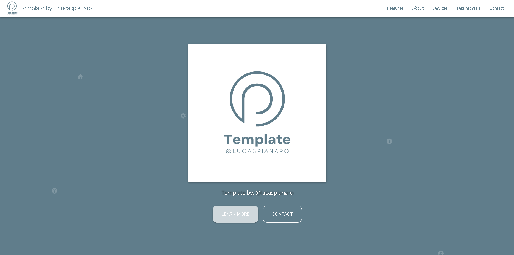
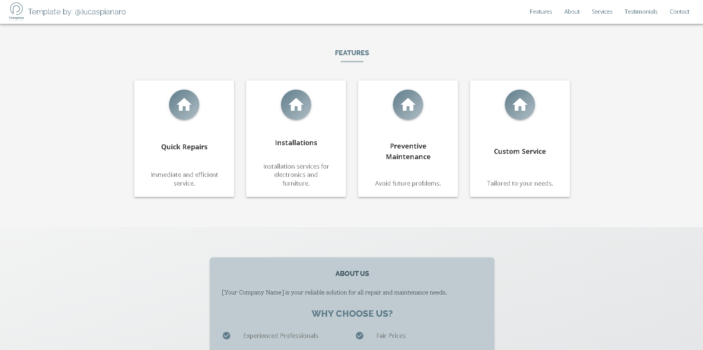
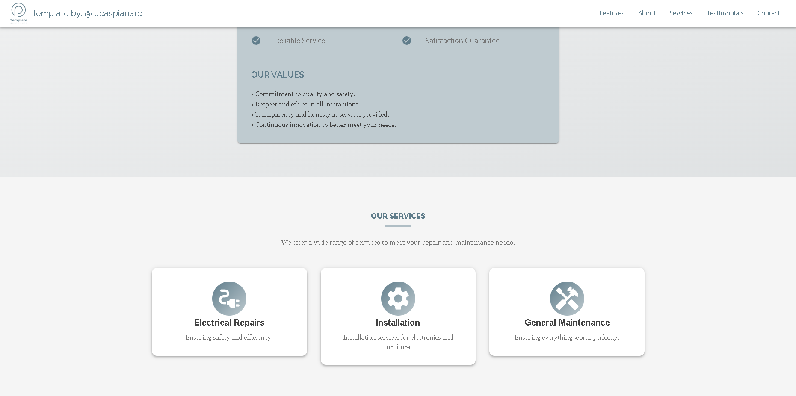
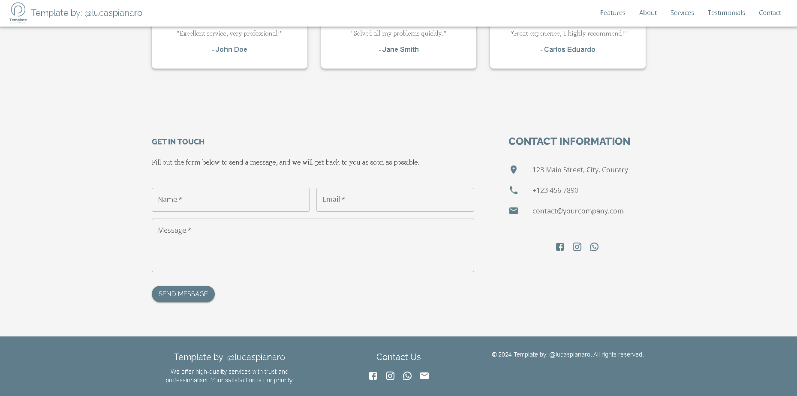

# landingpagetemplate

Welcome to the landingpagetemplate! This project is a highly customizable and modular React application designed to serve as a template for service-oriented businesses. The application is built using Material-UI for styling and includes various components to showcase features, services, testimonials, and more.

Link: https://landingpagetemplategit.web.app

## Table of Contents

- [Features](#features)
- [Screenshots](#screenshots)
- [Installation](#installation)
- [Usage](#usage)
- [Folder Structure](#folder-structure)
- [Customization](#customization)
- [Data Management](#data-management)
- [Deployment](#deployment)
- [Contributing](#contributing)
- [License](#license)
- [Credits](#credits)

## Features

- **Customizable Theme**: Easily modify colors, typography, and overall styling using Material-UI's theming capabilities.
- **Modular Components**: Reusable components for header, features, about section, services, testimonials, and contact.
- **Data-Driven**: Content is managed via a JSON file, making it simple to update without altering the component code.
- **Responsive Design**: The layout is fully responsive, ensuring the site looks great on both desktop and mobile devices.
- **Smooth Navigation**: Implemented smooth scrolling between sections for a seamless user experience.

## Screenshots






## Installation

To set up the project locally, follow these steps:

1. **Clone the repository**:
   ```bash
   git clone https://github.com/your-username/landingpagetemplate.git
   cd landingpagetemplate
   ```

2. **Install dependencies**:
   ```bash
   npm install
   ```

3. **Start the development server**:
   ```bash
   npm start
   ```
   The application will be available at `http://localhost:3000`.

## Usage

### Adding Content

- **Data Management**: All content (text, icons, links, etc.) is managed through the `data/data.json` file. Update this file with the relevant information for your business.

### Customizing the Theme

- The theme is defined in `src/common/theme.js`. You can customize the colors, typography, and other styling elements to match your branding.

### Customizing Components

- Each section of the website is a separate React component located in the `src/components/` directory. These components receive data via props, making them easy to reuse and customize.

## Folder Structure

Here is an overview of the project structure:

```
/src
  /common
    theme.js             # Custom Material-UI theme
  /components
    Header.js            # Hero section component
    Footer.js            # Footer component
    Features.js          # Features section component
    About.js             # About section component
    Navigation.js        # Navigation bar component
    Services.js          # Services section component
    Testimonials.js      # Testimonials section component
    Contact.js           # Contact section component
  /data
    data.json            # JSON file containing all the content data
  App.js                 # Main application component
  index.js               # Entry point of the application
```

## Customization

- **Theme Customization**: Modify the `theme.js` file to change the overall look and feel of the application.
- **Component Customization**: Components can be edited in the `src/components/` directory to change the layout, add new features, or adjust styling.
- **Data Customization**: Update `data.json` to reflect your company's services, testimonials, and contact information.

## Data Management

The content of the website is controlled via the `data.json` file. This allows for easy updates and scalability:

- **header**: Controls the main title and description on the homepage.
- **features**: Lists key features or services offered by the company.
- **about**: Contains the company description and reasons why customers should choose your services.
- **services**: Lists detailed services provided.
- **testimonials**: Contains customer feedback and testimonials.
- **contact**: Stores contact information such as address, phone, and email.

## Deployment

To deploy the application using Firebase Hosting, follow these steps:

1. **Build the project**:
   ```bash
   npm run build
   ```
   This command will create an optimized production build in the `build` directory.

2. **Install Firebase CLI** (if not already installed):
   ```bash
   npm install -g firebase-tools
   ```

3. **Login to Firebase**:
   ```bash
   firebase login
   ```

4. **Initialize Firebase in your project**:
   ```bash
   firebase init
   ```
   - Choose "Hosting" when prompted.
   - Select your Firebase project.
   - Specify the `build` directory as the public directory.
   - Choose "Single Page App" (rewrite all URLs to `index.html`).

5. **Deploy to Firebase**:
   ```bash
   firebase deploy
   ```

   After deployment, your application will be live on the web at your Firebase project's URL.

## Contributing

If you'd like to contribute to this project, please fork the repository and use a feature branch. Pull requests are warmly welcome.

1. Fork the repository
2. Create a feature branch (`git checkout -b feature/new-feature`)
3. Commit your changes (`git commit -am 'Add new feature'`)
4. Push to the branch (`git push origin feature/new-feature`)
5. Create a new Pull Request

## License

This project is licensed under the MIT License. You are free to use, modify, and distribute this software.

## Credits

This project was created by [@lucaspianaro](https://github.com/lucaspianaro). Feel free to contact me if you have any questions or suggestions!
